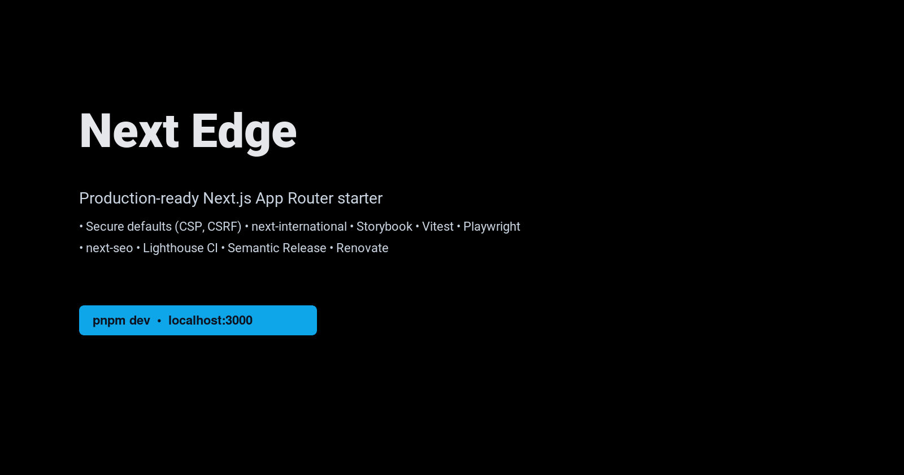

<div align="center">

<picture>
  <source type="image/svg+xml" srcset="docs/cover.svg" />
  
</picture>

# Next Edge

Production‑ready, pretty‑fast Next.js App Router starter with batteries included.

[](https://github.com/OWNER/REPO/actions/workflows/ci.yml)
[](https://codecov.io/gh/OWNER/REPO)
[](https://github.com/OWNER/REPO/releases)
[](https://renovatebot.com)
[](LICENSE)

[](https://gitpod.io/#https://github.com/OWNER/REPO)

</div>

Note: replace `OWNER/REPO` in badge URLs after you push to GitHub.

**Why Next Edge?** It’s a thoughtfully curated boilerplate focused on speed, DX, and production guardrails: secure defaults (CSP, CSRF), strong typing, internationalization, testing, Storybook, semantic releases, and CI that treats performance as a feature.

**Highlights**
- App Router, TypeScript, Tailwind v4, React 19, SWC
- Internationalization with `next-international` and locale‑aware routes
- Security headers + CSP via `headers()`; CSRF tokens for forms and API
- SEO via `next-seo`, sitemap/robots/manifest, structured data helpers
- Caching utilities, SWR provider, ETag‑aware `useCachedJson`
- Analytics consent gate with GTM/GA4/PostHog; Partytown for third‑party
- Tooling: Biome, Vitest, Playwright, Storybook, Commitlint, Renovate
- CI: tests + coverage (Codecov), Lighthouse CI, Storybook build, releases

## Quick Start

1) Install dependencies

```bash
pnpm install
```

2) Copy environment variables

```bash
cp .env.example .env.local
```

3) Run the dev server

```bash
pnpm dev
```

App runs at http://localhost:3000 and Storybook at http://localhost:6006.

## Scripts

- `pnpm dev` — start Next.js dev server
- `pnpm build` / `pnpm start` — production build and start
- `pnpm test` — unit tests with Vitest (`COVERAGE=true` for coverage)
- `pnpm test:e2e` — Playwright end‑to‑end tests
- `pnpm storybook` / `pnpm build-storybook` — Storybook
- `pnpm lint` / `pnpm format` — Biome lint/format
- `pnpm i18n:check` — verify translation keys
- `ANALYZE=true pnpm build` — bundle analyzer

## Project Structure

- `src/app` — App Router (routes, layouts, API routes)
- `src/components` — reusable UI components (Storybook stories co‑located)
- `src/providers` — providers for app context
- `src/stores` — Zustand state stores
- `src/actions` — Server Actions
- `src/hooks` — reusable hooks (named `useX.ts`)
- `src/lib` — utilities and HTTP helpers
- `src/schemas` — Zod schemas; `src/constants` — constants
- `src/i18n` — `next-international` config and helpers; messages in `messages/<locale>/<ns>.json`
- `__tests__` — unit tests with Vitest; e2e in `e2e`

## Features

- Security & CSP
  - Strict security headers configured in `next.config.mjs`
  - Update `script-src`, `connect-src`, `frame-src` if you add third‑party scripts
- CSRF Protection
  - CSRF cookie issued by `middleware.ts`; forms include hidden `_csrf`
  - `httpJson` adds `X-CSRF-Token`; server actions and API routes validate
- Internationalization
  - Locale negotiation in `middleware.ts`; `next-international` server/client helpers
- SEO & Metadata
  - Default SEO in `src/lib/seo.ts`; sitemap/robots/manifest generated on build
  - Set `NEXT_PUBLIC_SITE_URL` in `.env.local` for absolute URLs
- Analytics & Tags
  - Consent‑aware loading in `src/components/Analytics.tsx`
  - Supports GTM (`NEXT_PUBLIC_GTM_ID`), GA4 (`NEXT_PUBLIC_GTAG_ID`), PostHog
- Performance & DX
  - Partytown for third‑party scripts; Million Lint; bundle analyzer
  - SWR provider with ETag‑aware caching utilities

## Development

- Node version pinned via `.nvmrc`
- Lefthook enforces formatting/lint on commit and runs checks on push
- Conventional commits required (Commitlint). Example: `feat(app): add locale switcher`

## Testing & Quality

- Unit: Vitest (`pnpm test`), JSDOM test environment
- E2E: Playwright (`pnpm test:e2e`)
- Storybook: `pnpm storybook` for component dev
- Coverage uploaded to Codecov in CI

## CI/CD & Releases

- CI runs lint, type checks, tests, Storybook, Lighthouse CI
- Semantic Release creates versions and changelogs on `main`
- Renovate keeps dependencies up to date
- Optional BrowserStack E2E workflow available

## Contributing

See `CONTRIBUTING.md` for local setup, commit conventions, and PR guidelines. By participating you agree to the `CODE_OF_CONDUCT.md`.

## Security

If you discover a vulnerability, please follow the process in `SECURITY.md`.

## License

Licensed under the terms of the `LICENSE` file.
